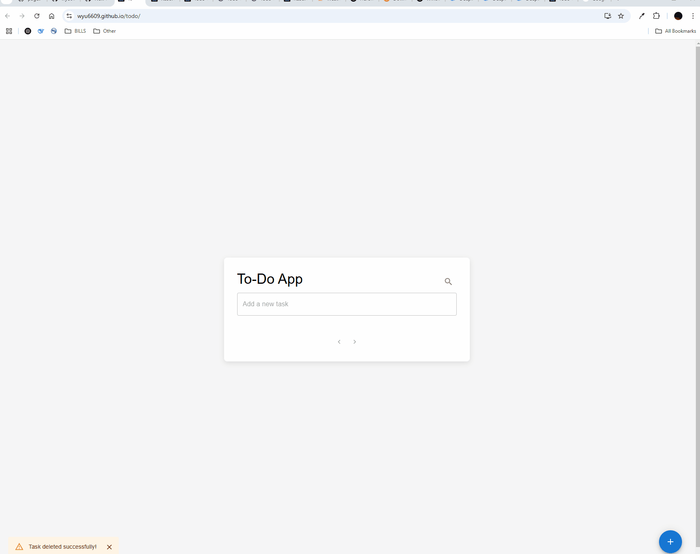

# To-Do App

[Simple Todo app](https://wyu6809.github.io/todo), built with React.js and Material-UI.

## Features

- Add, edit, and delete tasks
- Search and filter tasks
- Mark tasks as complete
- Persistent storage using local storage (browser cache)
- Responsive and modern UI with Material UI

## Installation

1. Clone the repository:

```sh
git clone git@github.com:wyu6609/todo.git
```

2. Navigate to the project folder:

3. Install dependencies:

```sh
 npm install
```

4. Start the application:

```sh
npm start
```

## DEMO

<p align="center"></p>
